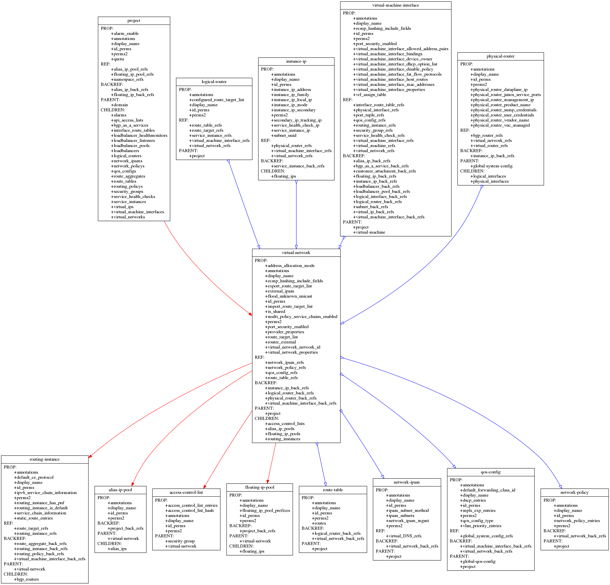

# Contrail-resource-explorer
Reource objects are connected through ref-backref and parent-children forming a graph. This script is to visualize the relationship between each object type.

## Usage
```
[cheny-mbp:~/]$ rexp -h
usage: rexp [-h] [-c PARENT_CHILD_DEPTH] [-r REFERENCE_DEPTH] [-d]
            [-f FILENAME] [-p {dot,neato,fdp,twopi,circo}] [--draw {pdf,png}]
            {domain,global-vrouter-config,instance-ip,network-policy,service-appliance-set,dsa-rule,discovery-service-assignment,floating-ip,virtual-machine-interface,alias-ip,floating-ip-pool,physical-router,bgp-router,virtual-network,virtual-router,bgp-as-a-service,subnet,virtual-DNS-record,global-system-config,loadbalancer-member,routing-policy,namespace,forwarding-class,provider-attachment,route-table,physical-interface,access-control-list,config-root,port-tuple,analytics-node,virtual-DNS,customer-attachment,service-instance,config-node,loadbalancer-pool,virtual-machine,interface-route-table,service-template,route-target,global-qos-config,virtual-ip,service-appliance,security-group,service-health-check,qos-config,database-node,alarm,loadbalancer-healthmonitor,loadbalancer-listener,api-access-list,project,logical-interface,route-aggregate,qos-queue,routing-instance,alias-ip-pool,network-ipam,loadbalancer,logical-router}
            [{domain,global-vrouter-config,instance-ip,network-policy,service-appliance-set,dsa-rule,discovery-service-assignment,floating-ip,virtual-machine-interface,alias-ip,floating-ip-pool,physical-router,bgp-router,virtual-network,virtual-router,bgp-as-a-service,subnet,virtual-DNS-record,global-system-config,loadbalancer-member,routing-policy,namespace,forwarding-class,provider-attachment,route-table,physical-interface,access-control-list,config-root,port-tuple,analytics-node,virtual-DNS,customer-attachment,service-instance,config-node,loadbalancer-pool,virtual-machine,interface-route-table,service-template,route-target,global-qos-config,virtual-ip,service-appliance,security-group,service-health-check,qos-config,database-node,alarm,loadbalancer-healthmonitor,loadbalancer-listener,api-access-list,project,logical-interface,route-aggregate,qos-queue,routing-instance,alias-ip-pool,network-ipam,loadbalancer,logical-router} ...]

A script to visualize the relationship between each object type in Contrail

positional arguments:
  {domain,global-vrouter-config,instance-ip,network-policy,service-appliance-set,dsa-rule,discovery-service-assignment,floating-ip,virtual-machine-interface,alias-ip,floating-ip-pool,physical-router,bgp-router,virtual-network,virtual-router,bgp-as-a-service,subnet,virtual-DNS-record,global-system-config,loadbalancer-member,routing-policy,namespace,forwarding-class,provider-attachment,route-table,physical-interface,access-control-list,config-root,port-tuple,analytics-node,virtual-DNS,customer-attachment,service-instance,config-node,loadbalancer-pool,virtual-machine,interface-route-table,service-template,route-target,global-qos-config,virtual-ip,service-appliance,security-group,service-health-check,qos-config,database-node,alarm,loadbalancer-healthmonitor,loadbalancer-listener,api-access-list,project,logical-interface,route-aggregate,qos-queue,routing-instance,alias-ip-pool,network-ipam,loadbalancer,logical-router}
                        Resource type name

optional arguments:
  -h, --help            show this help message and exit
  -c PARENT_CHILD_DEPTH, --parent_child_depth PARENT_CHILD_DEPTH
                        Define parent-children depth
  -r REFERENCE_DEPTH, --reference_depth REFERENCE_DEPTH
                        Define ref-backref depth
  -d, --detail          Show resrouce details including properties and
                        references
  -f FILENAME, --filename FILENAME
                        Output filename, default='rexp_out'
  -p {dot,neato,fdp,twopi,circo}, --prog {dot,neato,fdp,twopi,circo}
                        Layout engine, default='dot'
  --draw {pdf,png}      Output format

[cheny-mbp:~/]$ rexp virtual-network 
RESOURCE_TYPE: 
  virtual-network
PROP_FIELDS: 
  virtual_network_properties
  ecmp_hashing_include_fields
  display_name
  virtual_network_network_id
  address_allocation_mode
  router_external
  import_route_target_list
  provider_properties
  perms2
  route_target_list
  export_route_target_list
  flood_unknown_unicast
  id_perms
  external_ipam
  port_security_enabled
  multi_policy_service_chains_enabled
  annotations
  is_shared
REF_FIELDS: 
  route_table_refs
  network_ipam_refs
  qos_config_refs
  network_policy_refs
BACKREF_FIELDS: 
  logical_router_back_refs
  instance_ip_back_refs
  virtual_machine_interface_back_refs
  physical_router_back_refs
PARENT_TYPES: 
  project
CHILDREN_FIELDS: 
  routing_instances
  alias_ip_pools
  access_control_lists
  floating_ip_pools

[cheny-mbp:~/]$ rexp virtual-network -c 1 -r 1 --draw png -f vn

```

